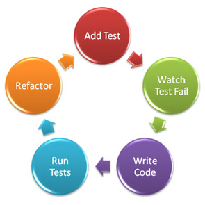

==================
 TDD from scratch
==================

.. First of all an introduction about myself, I'm not a great expert
.. of Test Driven Development, because I started to do it properly
.. only 6 month ago, so please correct me if I say something wrong.

.. However, having worked with and without I really decided that I'm
.. never going to do the mistake to work in another way anymore, and
.. I'm also now doing pushing all the people around me to do the same.

**If it's not tested, it's broken**

Twitter: @andreacrotti

Slides: https://github.com/AndreaCrotti/Unit-testing-talk

Working for http://www.wazoku.com/:

Benefits
========

.. If you have a good test coverage you will almost never need again
.. to spend endless time with your debugger, trying to find out what's
.. happened, because it will be very easy to know what can be the
.. source.

.. The last one seems exagerated but for me it was not.  When I had
.. some code without tests and someone asked me if it worked, the best
.. answer I could give is "it didn't fail yet", even if I thought
.. the code was good.
.. But I had no proof of what were the boundaries, I could only trust
.. myself that I did a good job.

- forget your debugger
- write better code
- only write what you need
- *sleep at night*

Dynamic language
================

.. So Python is a great language, but it's also very dynamic and
.. basically it only gives you runtime errors (except for syntax
.. errors).  You can use some great tools like Pylint to get a much
.. better static analysis but it's still far from what you can get
.. from a less dynamic language.
.. So more than enough rope to hang yourself!

Python is **awesome**, but...

- duck typing
- no checked exceptions
- no compilation

Why
===
.. Here for example I have this function that under some rare
.. condition would fail
.. Can you see any problem with it?

.. rst-class:: build

.. code-block:: python
   
    Traceback (most recent call last):
      File "rare_cond.py", line 21, in <module>
        smart_function(42)
      File "rare_cond.py", line 7, in smart_function
        report_error(argO)
    NameError: global name 'argO' is not defined
    
.. literalinclude:: code/rare_cond.py
    :pyobject: smart_function

Fail
====

    
Why 2
=====

.. Here is another example from my personal experience, I actually got
.. bitten many times by this.  What happens if you pass by mistake a
.. string instead of a list of strings to a function that takes an
.. iterable?

.. Well thanks to duck typing it just threats the string as an
.. iterable and gives you a result, which is most likely not the one
.. you want!

.. rst-class:: build

::

    ['W', 'O', 'R', 'D', '1']

::

    >>> uppercase_words("word1")

.. literalinclude:: code/wrong.py
    :pyobject: uppercase_words

Does not fails, but still clearly **wrong**

Fail
====

Unit test
=========

.. The good news though is that Python is really awesome for writing
.. unit tests, (I even used it in the past to unit test java code with
.. Jython for example).

.. A unit test is small, isolated, testing a very small part of the
.. code.  When a test fail you would know the 5-lines range of code
.. that generates the problem.

.. It's not a unit test if something else that it's not the specific
.. part of the code has to work

.. The fast is really important actually, because for TDD you really
.. need to run your tests continuosly, before every commit, and if you
.. start to have slow tests it will get too annoying very quickly.

- small
- isolated
- localized
- without external dependencies
- **fast**

Not a unit test
===============
.. TODO: see if this should be there at all, maybe it's not so
.. necessary

.. Here is an example of what not a unit test is, the following code
.. should test a reporting function, but before doing that it needs to
.. put some values into a database.

.. literalinclude:: code/not_unit.py

Change of perspective
=====================

.. When you start to write your code with unit tests in mind, there is
.. a big change of perspective.  The question is not anymore *how do I
.. get this working*, but *how do I test it*?  And it turns out that
.. this question is much more valuable, because in the end you want to
.. ship something that you can prove to be working.

.. But programmers are lazy as you know

Not *how do I get this working?*, but **how do I test it?**

- What is the easiest thing to test?

Pure Functions
==============

.. We have a pure function whenever it returns always the same output
.. for the same input, without changing anything in the global environment.

.. The most stupid example can be the addition function.  The great
.. thing is that pure functions are trivial to test.  The only thing
.. you need to do is to write an input-output table of interesting
.. couples to test and check all of them.
.. Passing input X to function F will always return the same output Y.

- adder(1, 2) = 3
- adder(3, 4) = 7

.. show how to test pure functions, in calc_one.py and calc_2.py

Testing pure functions
======================
.. literalinclude:: code/calc_1.py
    :lines: 1-16

.. show examples from calc_1.py and calc_2.py

Side effects
============

.. unfortunately life is not so simple, and we can't only work with
.. pure functions, otherwise our program would not be able to do
.. anything useful.

.. We also have side effects, where a side effect happens whenever a
.. function in addition to returning a value, also modifies some state
.. or has an observable interaction with calling functions.

.. For example, a function might modify a global or static variable,
.. modify one of its arguments, raise an exception, write data to a
.. display or file, read data, or call other side-effecting functions.

**In addition to returning a value, it also modifies some state or has an observable interaction with calling functions or the outside world**

.. literalinclude:: code/funcs.py
    :pyobject: silly_function

::

     >>> funcs.silly_function(1)
     3
     >>> funcs.silly_function(1)
     4

**Hard to test!!**

Dependency injection
====================

.. literalinclude:: code/dep_inj.py
    :lines: 1-6

How do I remove the external dependency?

*Dependency injection*

Dependency injection 2
======================

.. literalinclude:: code/dep_inj.py
    :pyobject: ReportDep
    
.. literalinclude:: code/dep_inj.py
    :pyobject: test_report

**UGLY**

Dynamic Python
==============

- run-time name binding

library.py:

.. literalinclude:: code/library.py

Dynamic Python 2
================

Rebinding names from other modules!

prog.py:

.. literalinclude:: code/prog.py

Mocking
=======

Automate the Mocking process.

**Every time you mock you do one step away from the real system**

**Functional core, imperative shell**

Patching
========

lib.py:

::

    from os import listdir
    
    def filter_dirs(pth):
        for l in listdir(pth):
            if 'x' in l:
                yield l
    
test_lib.py:

::

    class TestLib(unittest.TestCase):
        @patch('lib.listdir', new=lambda x: ['one', 'two', 'x'])
        def test_filter_dirs(self):
            res = list(lib.filter_dirs('.'))
            self.assertEqual(len(res), 1)

Mocking
=======

Mock the behaviour of an object that we don't want to run.

::

    class ComplexObject(object):
        def method(self):
            print("Very complex and expensive")
    
    
    class Obj(object):
        def __init__(self):
            self.c = ComplexObject()
            self.c.method()
    
::

    fake_complex_object_auto = Mock(autospec=lib.ComplexObject)
    @patch('lib.ComplexObject', new=fake_complex_object_auto)
    def test_obj(self):
        v = lib.Obj()

TDD cycle
=========

1. add a test, focusing on the *requirements*
2. run the test to make it fail
3. make it pass
4. refactor
5. back to 1

.. show an example of how this is done

.. Write the test:
.. Being able to write the tests before writing the code means that we
.. really need to understand the requirement well, and we force
.. ourselves to take some time thinking about them, before we get
.. cracking writing some code.

.. Make it pass minimally:
.. After we wrote a test, write the simplest thing that can make it
.. pass, and not more

.. show some examples of why these things can be bad (passing wrong types,
.. raising things from anywhere and so on)

Make it fail
============

.. this second step is understimated but it's very important, because
.. it removes the possibility that the test you're writing would not
.. be always passing for a programming error, and thus completely useless

.. The reason is that there is nothing wrong than having tests with
.. simple bugs that are always passing, because in this way you would
.. never check that the bug is in the *empty* since there is a passing
.. test for that.

- the test should fail if there is a bug

::

    class Queue(object):
        def __init__(self):
            self.queue = []
    
        def empty(self):
            return self.queue == []
    
::

    def test_queue_empty():
        q = Queue()
        assert q.empty, "Queue is not empty in the beginning"

Refactoring example
===================

.. literalinclude:: code/refactor/refactor.py
   :pyobject: long_crappy_function

.. how can I actually test this function, it takes no arguments and it
.. needs to access to the filesystem, mysql and manipulate a list

.. the great thing about python is that we can still do but it's much
.. harder

Coverage
========

http://nedbatchelder.com/code/coverage/

- set a tracer function
- runs a script
- keep track of all the lines executed
- show a report

As simple as:

*nosetests show_cov.py --with-cov --cov-report=html*

Coverage 2
==========

.. literalinclude:: code/show_cov.py
   :pyobject: smart_division

Conclusion
==========

- tests are good
- tests are documentation
- testing is easy
- testing alleviates the fear of change
- testable code is *better code*

Resources
=========

.. _tip: http://lists.idyll.org/listinfo/testing-in-python
.. _nose: https://nose.readthedocs.org/en/latest/
.. _mock: http://www.voidspace.org.uk/python/mock/
.. _coverage: http://nedbatchelder.com/code/coverage/
.. _func_imp: https://www.destroyallsoftware.com/screencasts/catalog/functional-core-imperative-shell

- tip_
- nose_
- mock_
- coverage_

.. image:: img/questions.jpg
